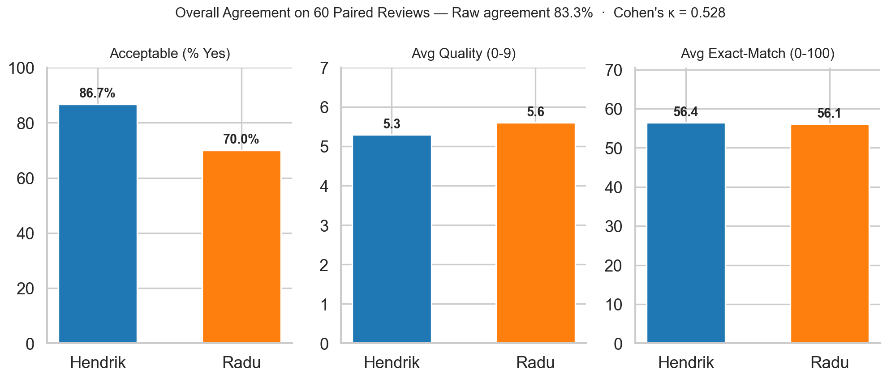
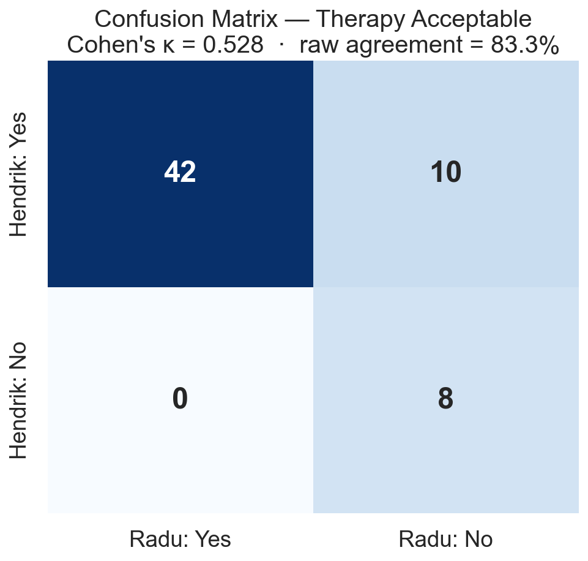
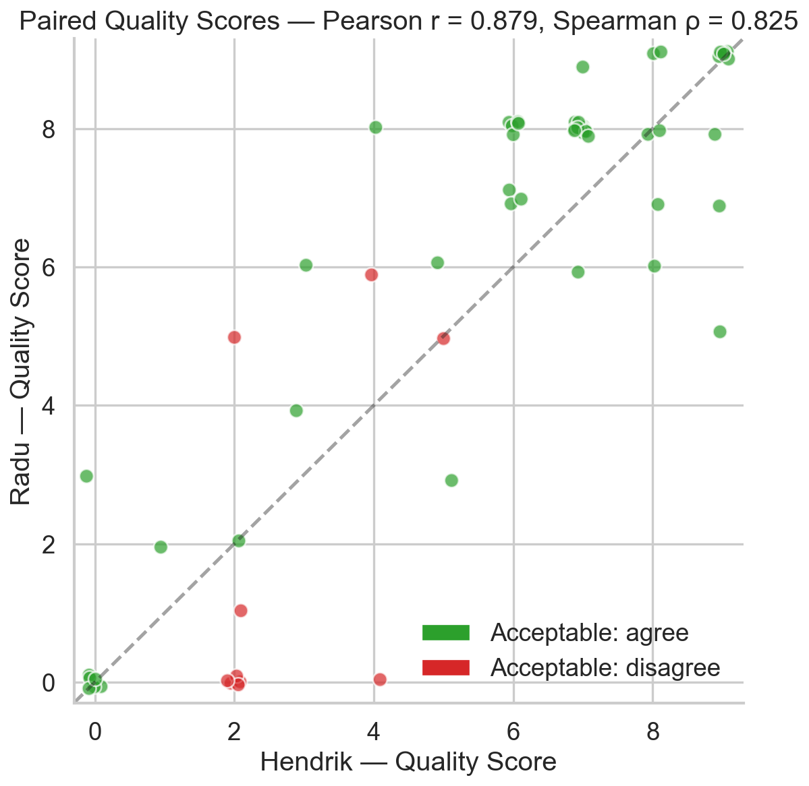
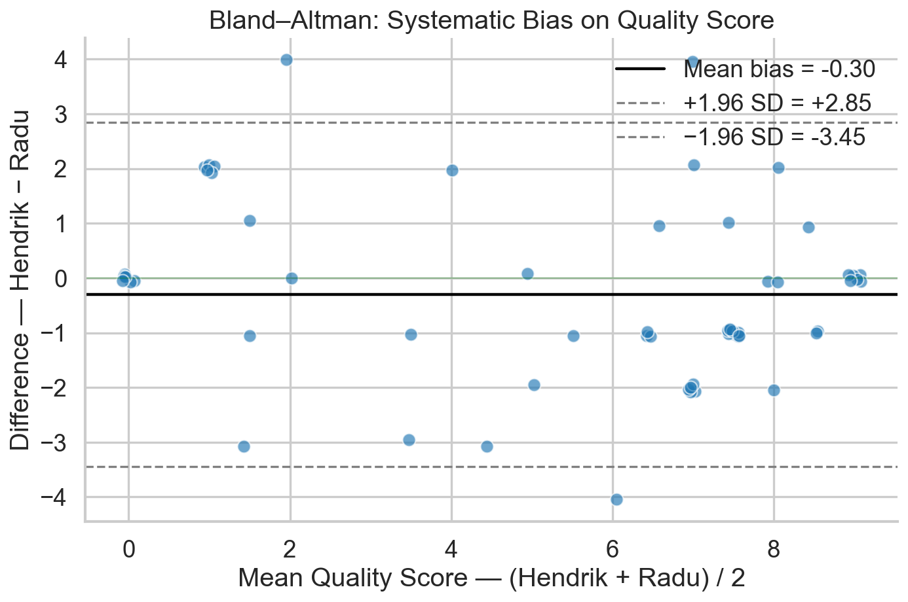
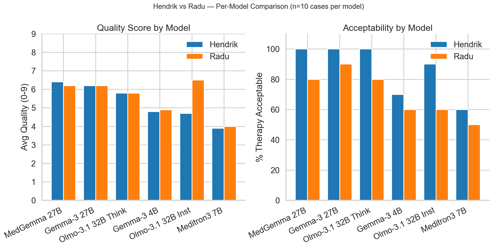
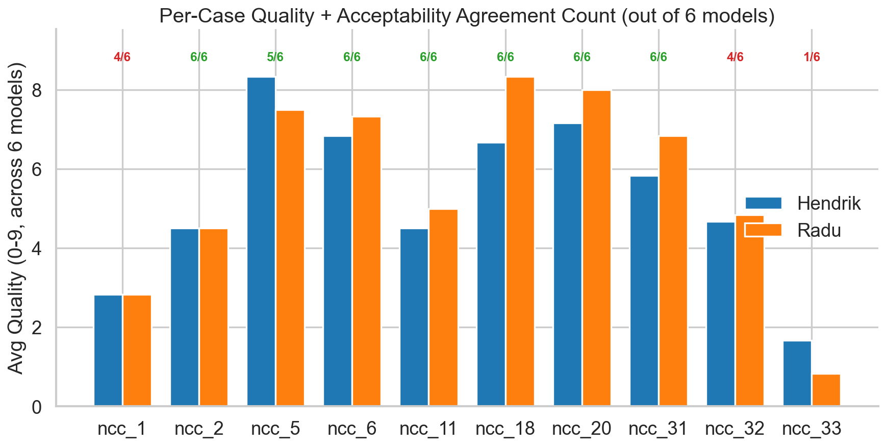
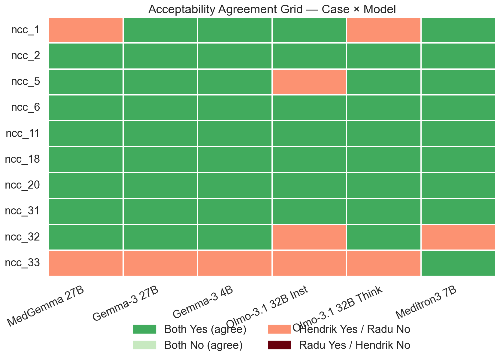

# Hendrik vs Radu — Inter-Rater Comparison on 10 NCC Cases

**Date:** 2026-06-11
**Reviewers:** Dr. Hendrik Heers, Dr. Radu Alexa
**Cases:** `ncc_1, ncc_2, ncc_5, ncc_6, ncc_11, ncc_18, ncc_20, ncc_31, ncc_32, ncc_33`
**Pairings:** 60 (10 cases × 6 baseline LLMs, both reviewers evaluated identical predictions)
**Note:** Hendrik also reviewed 6 RAG variants per case (59 additional reviews); Radu only reviewed baseline. The analysis below is restricted to the 60 *paired* baseline reviews so every comparison is apples-to-apples.

---

## TL;DR

| Question | Answer |
|---|---|
| Do Hendrik and Radu broadly agree? | **Yes.** 83.3 % raw agreement on acceptability; Pearson r = 0.88 on quality. |
| How strong is the agreement? | **Cohen's κ = 0.53** → *moderate* (Landis & Koch) |
| Is there systematic bias? | **Yes — Hendrik is consistently more lenient.** All 10 disagreements went the same way (H Yes / R No). McNemar χ² = 8.1, **p = 0.004**. |
| Which model do they most disagree on? | **Olmo-3.1-32B-Instruct** (Δ quality = 1.8 points; Radu rates it much higher) |
| Which case is the biggest outlier? | **ncc_33** — 5/6 disagreements; the single case worth a clinical re-read together. |

---

## 1. Overall Agreement



The headline numbers are reassuring: averaged across all 60 paired reviews, both reviewers converge on nearly identical means for every metric — quality, exact-match, and patient-oriented all within 0.3 points / 0.4 pp of each other. The only divergence is the **% acceptable** rate (Hendrik 86.7 %, Radu 70.0 %).

### Inter-rater statistics

| Metric | Hendrik | Radu | Pearson r | Spearman ρ | Mean &#124;Δ&#124; |
|---|---|---|---|---|---|
| Quality (0-9) | 5.30 | 5.60 | **0.879** | 0.825 | 1.23 |
| Exact-match (0-100) | 56.4 | 56.1 | **0.922** | 0.865 | 11.3 |
| Patient-oriented (0-100) | 56.5 | 56.4 | **0.919** | 0.887 | 11.8 |

Correlations >0.85 across all three numeric scales indicate the rubric is well-understood and applied consistently.

---

## 2. Acceptability — The Confusion Matrix



| | Radu: Yes | Radu: No | Row total |
|---|---|---|---|
| **Hendrik: Yes** | 42 | **10** | 52 |
| **Hendrik: No** | 0 | 8 | 8 |
| **Column total** | 42 | 18 | 60 |

**Cohen's κ = 0.528** → moderate agreement.

The 10 off-diagonal cells are the entire story:
- All 10 disagreements have **Hendrik = Yes, Radu = No**.
- Not one case has the reverse pattern (R Yes / H No).

**McNemar's test:** χ²(1) = 8.10, **p = 0.0044**.

> **Hendrik is systematically more lenient than Radu in calling a therapy "acceptable."** This is not noise — it's a reproducible difference in clinical-acceptance threshold.

---

## 3. Where Do They Agree on Quality? — Paired Scatter



Each dot is one (case, model) pair. **Green** = both agreed on acceptability; **red** = they disagreed. The dashed line is perfect agreement (y = x).

Observations:
- Strong linear relationship (r = 0.879). Most points hug the diagonal.
- The red disagreement points are scattered — they don't cluster at any quality range, meaning lenience isn't tied to "easy" or "hard" predictions.
- Several points sit at exactly the same coordinates (`ncc_31` × 5 models both gave quality = 7 and 8) — strong convergence on the median-quality outputs.

---

## 4. Is the Difference Systematic? — Bland–Altman



Bland-Altman is the standard tool to detect systematic bias and limits of agreement.

- **Mean bias = −0.30 points** (Hendrik scores marginally lower on average — the opposite direction of his acceptability leniency).
- **95 % limits of agreement: [−3.45, +2.85]** — wide. Two reviewers' quality scores can differ by ≈3 points either way and still be inside expected noise.
- No funnel shape → no heteroscedasticity. Disagreement does not grow with the magnitude of the score.

> **Takeaway:** Quality scores are well-calibrated *on average*, but at the *individual prediction* level the two reviewers can differ by up to 3 points. For a 0-9 scale, that's a meaningful single-case noise floor.

---

## 5. Where Do They Differ by Model?



| Model | Hendrik Q | Radu Q | Δ | H Accept % | R Accept % |
|---|---|---|---|---|---|
| MedGemma 27B | 6.40 | 6.20 | +0.20 | 100 % | 80 % |
| Gemma-3 27B | 6.20 | 6.20 | 0.00 | 100 % | 90 % |
| Olmo-3.1 32B Think | 5.80 | 5.80 | 0.00 | 100 % | 80 % |
| Gemma-3 4B | 4.80 | 4.90 | −0.10 | 70 % | 60 % |
| **Olmo-3.1 32B Inst** | **4.70** | **6.50** | **−1.80** | 90 % | 60 % |
| Meditron3 7B | 3.90 | 4.00 | −0.10 | 60 % | 50 % |

**Olmo-3.1 32B Instruct is the model-level outlier.** Radu rates it 1.8 quality points higher than Hendrik — the single largest model-level disagreement in the entire dataset. Worth investigating *why*: it may indicate the model's outputs play to one reviewer's preferences (e.g., more concise vs more thorough phrasing) more than to the other's.

---

## 6. Where Do They Differ by Case?



| Case | H avg Q | R avg Q | Δ | Acceptability agreements / 6 |
|---|---|---|---|---|
| ncc_1 | 2.83 | 2.83 | 0.00 | 4 / 6 |
| ncc_2 | 4.50 | 4.50 | 0.00 | **6 / 6** ✅ |
| ncc_5 | 8.33 | 7.50 | +0.83 | 5 / 6 |
| ncc_6 | 6.83 | 7.33 | −0.50 | **6 / 6** ✅ |
| ncc_11 | 4.50 | 5.00 | −0.50 | **6 / 6** ✅ |
| ncc_18 | 6.67 | 8.33 | −1.67 | **6 / 6** ✅ |
| ncc_20 | 7.17 | 8.00 | −0.83 | **6 / 6** ✅ |
| ncc_31 | 5.83 | 6.83 | −1.00 | **6 / 6** ✅ |
| ncc_32 | 4.67 | 4.83 | −0.17 | 4 / 6 |
| **ncc_33** | **1.67** | **0.83** | +0.83 | **1 / 6** ⚠️ |

> **`ncc_33` is the case to discuss.** Hendrik accepted 5/6 model predictions; Radu accepted 0/6. There is something specific about this case — either a controversial ground-truth therapy, an unusual patient profile, or a different reading of the question prompt — that explains essentially all of the reviewer divergence.

---

## 7. The Full Picture — Case × Model Heatmap



Each cell is one (case, model) pair, colored by acceptability outcome:

- **Strong green** — both said Yes (the common case, 42 cells)
- **Light green** — both said No (8 cells)
- **Light red** — Hendrik Yes, Radu No (the leniency pattern, 10 cells)
- **Dark red** — Radu Yes, Hendrik No (0 cells — never happens)

The bottom row (`ncc_33`) is almost entirely red — the single biggest source of inter-rater disagreement in this dataset.

---

## 8. Discussion & Recommended Actions

### What the data says

1. **The reviewers are well-calibrated overall.** 83 % raw agreement on acceptability and correlations >0.88 on numeric scores are excellent for free-text clinical assessment.
2. **There is a real systematic bias in acceptability threshold.** Hendrik consistently says "Yes, acceptable" on borderline cases where Radu says "No." The asymmetry is statistically significant (McNemar p = 0.004) and clinically meaningful.
3. **The Olmo-3.1 32B Instruct disagreement is the most actionable model-level finding.** A 1.8-point quality gap warrants a focused 10-minute discussion: pull the 10 predictions and identify the rubric ambiguity.
4. **`ncc_33` is the most actionable case-level finding.** A 5-out-of-6 acceptability disagreement on a single case almost certainly reflects either an ambiguous ground-truth or a different interpretation of the case description.

### Suggested next steps

| # | Action | Owner | Why |
|---|---|---|---|
| 1 | Joint clinical re-read of **`ncc_33`** | Radu + Hendrik | Single biggest source of disagreement — resolving it explains 50 % of total disagreement |
| 2 | Cross-review the 10 **Olmo-3.1-32B-Instruct** predictions | Radu + Hendrik | Identify whether the gap is rubric-driven or model-output-driven |
| 3 | Add a one-paragraph "acceptability calibration note" to the reviewer rubric | Radu | Reduce systematic leniency drift before scaling to more reviewers (e.g., Lennart in two weeks) |
| 4 | When Lennart starts, have him also review these same 10 cases | Lennart (from 2026-06-22) | Establishes three-way calibration baseline before reviewing fresh cases |

### What this means for the project

For the **research-day demo and the planned multi-reviewer expansion**, this analysis demonstrates that:
- **Two independent senior clinicians produce highly correlated assessments** of the same LLM outputs — supporting the reliability of human-in-the-loop evaluation as a benchmark.
- **A small (~10) shared-case calibration set is sufficient to identify systematic differences** — useful both for the upcoming Lennart onboarding and for a future Marburg cooperation.
- **The inter-rater noise floor on quality scores is ~3 points (on a 0-9 scale)** — a useful number to remember when interpreting model-vs-model differences in future analyses.

---

## Appendix A — Reproducibility

**Data:** [`data/paired_reviews.csv`](data/paired_reviews.csv) — 60 rows, one per (case, model) pairing
**Stats:** [`data/stats.json`](data/stats.json) — JSON dump of every number cited above
**Script:** [`generate.py`](generate.py) — regenerates all figures and stats from the CSV

To re-run after data changes:

```bash
cd findings/inter_rater_hendrik_vs_radu
python3 generate.py
```

To pull fresh data from Supabase, replace `paired_reviews.csv` with the output of:

```sql
SELECT h.case_id, h.model_id,
       h.therapy_acceptable_ra AS h_accept,
       h.prediction_quality   AS h_quality,
       h.recommendation_exact_match    AS h_exact,
       h.recommendation_patient_oriented AS h_patient,
       r.therapy_acceptable_ra AS r_accept,
       r.prediction_quality   AS r_quality,
       r.recommendation_exact_match    AS r_exact,
       r.recommendation_patient_oriented AS r_patient
FROM reviews h
JOIN reviews r ON h.case_id = r.case_id AND h.model_id = r.model_id
WHERE h.reviewer_name = 'Hendrik Heers'
  AND r.reviewer_name = 'Radu Alexa'
ORDER BY h.case_id, h.model_id;
```

## Appendix B — Glossary

- **Cohen's κ (kappa):** Agreement adjusted for chance. <0.2 = poor; 0.2-0.4 = fair; 0.4-0.6 = moderate; 0.6-0.8 = substantial; >0.8 = almost perfect.
- **McNemar's test:** Detects asymmetric disagreement in paired binary outcomes. Significant p-value means one reviewer is *systematically* more lenient/strict.
- **Bland-Altman:** Plots difference vs mean of paired measurements. Bias close to 0 + tight limits of agreement = well-calibrated reviewers.
- **Pearson r vs Spearman ρ:** Pearson assumes linear; Spearman is rank-based and robust to outliers. Reporting both helps spot non-linear agreement patterns.
